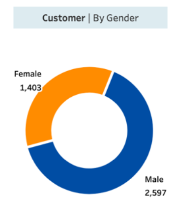
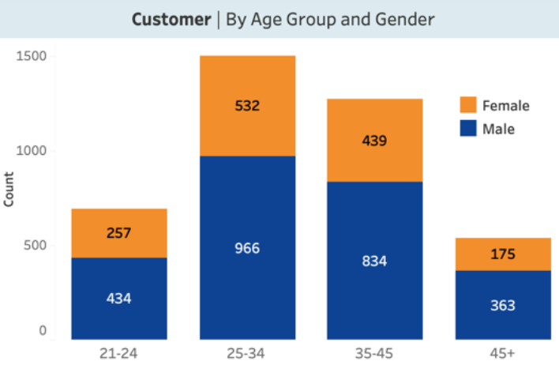
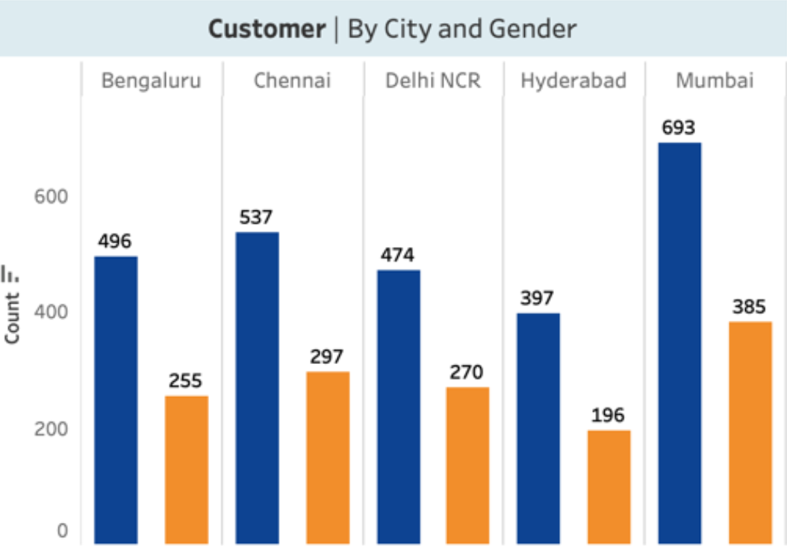
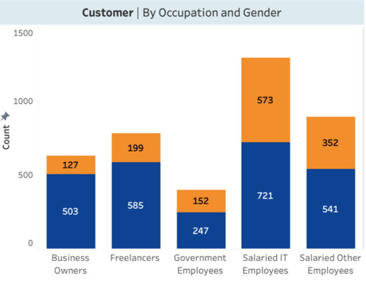
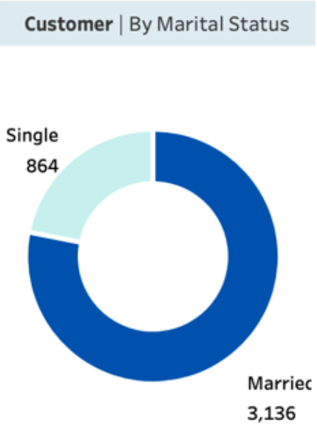

# Mitron Bank: Analysis for New Credit Card Launch
## Created by Yawen Cao [Linkeldin Profile](https://www.linkedin.com/in/yawen-cao-306975337/)
### Live Dashboard at Tableau Public [Live_link_Tableau_Public](https://public.tableau.com/views/BankData_dashboard/DemographicAnalysis?:language=en-US&:sid=&:redirect=auth&:display_count=n&:origin=viz_share_link)

#
## Table of Content
1. [About Mitron Bank](#about-mitron-bank)
2. [Objective of the Project](#objective-of-the-project)
3. [Problem Statment](#problem-statment)
4. [Demographic Classification](#demographic-classification)
5. [Income Utilization & Spending Analysis](#income-utilization--spending-analysis)
6. [Table Grid View Page](#table-grid-view-page)
7. [Recomendation](#recomendation-for-next-credit-card)
8. [Footer](#dont-forget-to-give-a-start-to-this-project-because-its-motivate-me-and-also-please-follow-me-on-linkeldin-and-please-consider-me-for-any-internship-or-entry-level-data-analyst-role-i-need-a-job-or-internship-even-thought-its-a-free-or-paid-thanks-in-advance)

#
### About Mitron Bank 
Mitron Bank is a legacy financial institution headquartered in Hyderabad. They want to introduce a new line of credit cards, aiming to broaden its product offerings and reach in the financial market.

### Objective of the Project 
This project serves as a pilot for Mitron Bank’s credit card expansion. It analyzes the provided sample data and delivers actionable insights to the strategy team, helping them tailor credit card offerings to customer needs and market trends to increase market share.

### Problem Statment   

 * **Demographic classification:** Segment customers based on demographic attributes such as age group, gender, occupation, and city to uncover meaningful patterns in their financial behavior.
   
 * **Avg income utilisation %:** Calculate the average income utilization percentage (avg_spends / avg_income), a key metric indicating the likelihood of credit card usage—higher utilization suggests a greater propensity to adopt and use credit cards.
   
 * **Spending Insights:** Analyze where customers spend the most and examine how spending varies across demographics (occupation, gender, city, age). These insights can inform targeted offers, such as specialized rewards for specific purchase categories or demographic groups.

 * **Key Customer Segments:** Identify and profile high-value customer segments most likely to adopt the new credit cards by exploring their demographic characteristics, spending habits, and financial preferences.

 * **Credit Card Feature Recommendations:** Recommend key credit card features that would increase customer adoption and usage, based on observed behaviors and segment-specific needs.
#

## Demographic Classification:   
For demographic classification, a thorough customer demographic analysis was conducted using Tableau, and here are key findings presented in a visually engaging manner:

### Total Customers:

* The dataset includes a sample of 4,000 customers, which serves as the solid foundation of our analysis.

### Gender Segmentation:

* The total of 4000 customers includes 2597 males (64.93%) and 1403 females (35.08%), indicating a slightly male-dominated demographic. 

### Age Group Profiling: 

* Primary Target Segment: The age group 23-36 emerges as our largest and most significant custoemr segment, with 1948 customers. This group, especially males, exhibits the strong presence (73.3%). The strategy team should prioritize developing and marketing cards with features that appeal to young and mid-career career male professionals(e.g., rewards on tech, dining, travel, or fitness). 

* Secondary Target Group: The 35-45 age group is another key demographic, comprising 1273 individuals. This demographic is likely entering peak earning years, making it ideal for premium cards, balance transfer offers, or family-oriented benefits (e.g., enhanced travel insurance, educational expense tracking). 

* Balanced Niche Segment: Customer aged 21-24 and 45+ are smaller but exhbit relatively balanced gender distribution. This presents an opportunity for niche, university positioned products. For the younger group, consider starter cards with credit-builiding features. For 45+ group, focus on secruity, legacy benefits, and retirement lifestyle perks. 

### City-wise distribution:

* Core Market (Mumbai): Our leadig hub with 1078 customers, showing a pronounced male skew. 
* Secondary Hubs (Chennai, Banglore, Delhi NCR): Significant contributor to our customer base, each also demonstrating a male-skewed demographic. 

### Occupation Insight:

 * Salaried IT Employees represent our largest portion of our customer base (1294 cutsomers), this tech-centric base skews male(+148), confirming a strong initial foothold in this high-income demographic. This is our prime audience for aggresive cross-selling of premium cards with tech-focused perks, travel benefits and partner offers. 
 * The diversity in occupations, inlcuding freelancers and busines owners, presents an opportunity to tailor services for varied professional needs, such as unique cash flow and expense management needs. 

 ### Marital Status Summary:
 

* Dominant Segment – Married Customers: The vast majority of our base is married (3,136 | 78.4%), underscoring a core demand for family-oriented financial products and joint account features.

* Growth Opportunity – Single Customers: The substantial single segment presents a clear opportunity to capture new market share by designing convenient, lifestyle-focused rewards tailored to individual spending habits.
 

